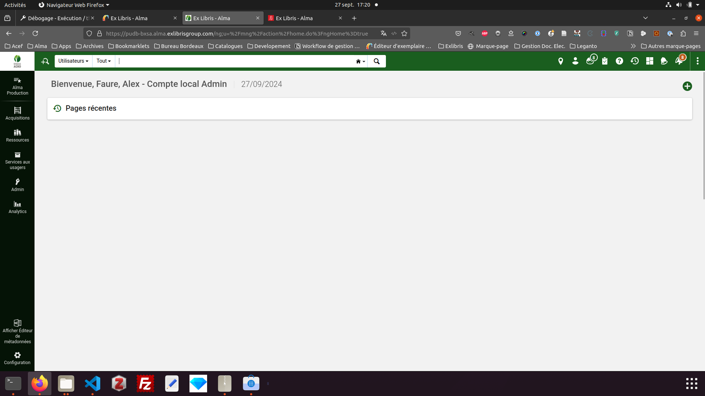

# Plugin Firefox pour changer le Favicon d'Alma en fonction de l'instance utilisée
Ce module Firefox va modifier le favicon dans Alma en fonction de l'instance utilisée. Il permet aux administrateurs au nivea réseau de se répérer plus facilement lorsqu'ils travaillent sur différentes instances.
> [!IMPORTANT]  
> Travail grandement inspiré de celui de [@symac](https://www.github.com/symac) (cf. son [Plugin Firefox pour Alma](https://github.com/symac/firefox-alma-ubm/blob/main/README.md))
> Une fois de plus, un grand merci à lui pour m'avoir mis sur la voie
## Fonctionnement
L'extention se base sur le sous domaine d'Alma (ex: https://pudb-iep.alma.exlibrisgroup.com --> iep) pour identifier l'institution et remplacer le favicon d'Alma par celui stocké dans le réperoire icons. \
La zone réseau (network) conserve l'icône d'origine.\


Affichage pour un bureau de consultation sur place

## Modification du module
Si l'on souhaite apporter des modifications au module, on trouvera les éléments à modifier principalement sous : 

* ```icons``` : répertoire de stokage des favicons de substititutions. Ils doivent être nommés ainsi ```[code institution].ico```
* ```change_alma_favicon.js``` : la logique qui va déterminer les changements apportés à l'affichage
* ```manifest.json``` : les métadonnées sur l'extension

## Packaging et distribution de l'extension
L'extension étant destiné à un public de niche, vos utilisateurs professionnels, il n'est pas possible de la diffuser au travers du store d'extensions de mozillas, mais il faudra tout de même passer par leurs services pour *packager* l'extension.

Cela se passe au niveau du pôle développeur sur https://addons.mozilla.org/fr/developers/addons où l'on va créer un nouveau module que l'on choisira de distribuer nous même.

Une fois cela fait, il faudra envoyer une version de notre extension au site. Pour cela, on va se placer dans le dossier de l'extension et créer un fichier zip à l'aide de la commande suivante :

```zip -r -FS ../mon-extension-x-y.zip * -x '*.git*' -x 'images/*' -x 'README.md'```


Cela aura pour effet de créer au niveau supérieur un fichier .zip que l'on pourra envoyer à l'espace développeur de Mozilla. 

Après quelques minutes, on recevra normalement un message nous indiquant que l'extension a été validée et l'on pourra aller sur le site récupérer un fichier .xpi signé par Mozilla et qui peut être installé dans Firefox.